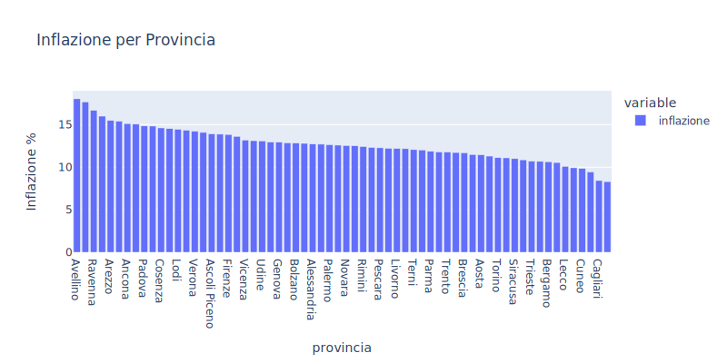
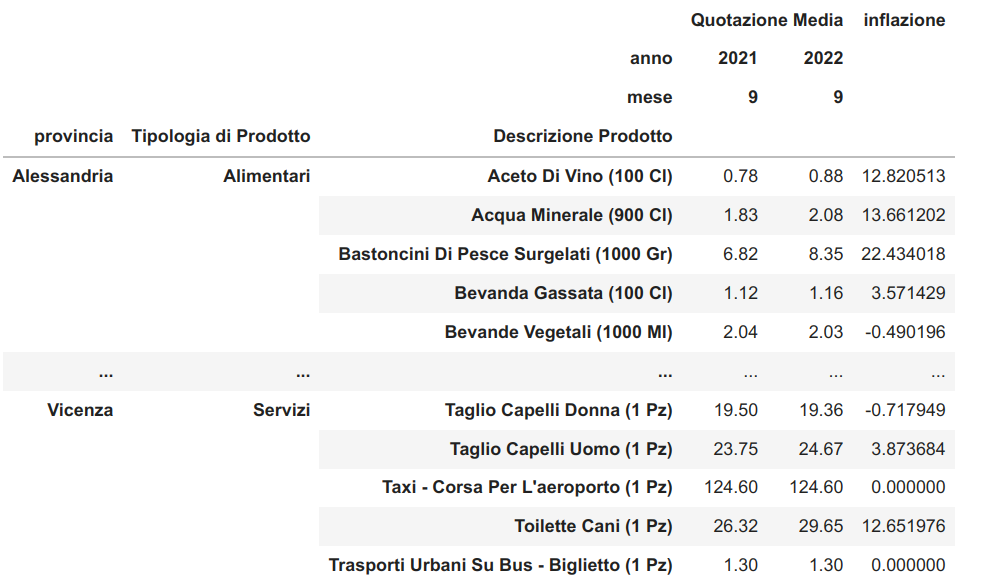

# L' Inflazione secondo tua zia

Il governo e i matusa ci dicono che l'inflazione è circa all' X, ma le nostre zie hanno un'esperienza ben diversa quando tornano scalze dal supermercato.

Purtroppo la metrica dell'inflazione è ricoperta di un'aura mistica, soggetta a un paniere di prodotti e servizi che qualcuno decide da qualche parte, e ci sembra che questo qualcuno faccia gli interessi più dell'establishment che del cittadino.

Con questi notebook andiamo a misurare l'inflazione in un modo più brutale, ma più vicino ai cuori delle nostre zie:
1. senza selezionare un paniere, ma con tutti i prezzi a disposizione. Esatto... e se qualcuno dell'amministrazione decide di fare un calcolo diverso, magari basato sui volumi di vendita, che pubblichino i volumi di vendita.
2. in open source e open data, di modo che la misura sia ripetibile, esplicita e modificabile. Chi ha critiche, commenti o migliorie può farlo senza chiedere permesso a nessuno.

La prima iterazione del progetto parte da dati [messi a disposizione dal MISE](https://osservaprezzi.mise.gov.it/prezzi/livelli/beni-e-servizi-di-largo-consumo/archivio-rilevazioni-beni-e-servizi-di-largo-consumo).
Se trovi altre fonti di dati, contribuisci al progetto!

# Risultati

I seguenti grafici riguardano l'inflazione tra Settembre 2021 e Settembre 2022

## Inflazione generale: 12.607 %

## Voglio smanettare con i dati

Ci sono due notebook, uno per scaricare i dati dal MISE e uno per fare stats e grafici. Le pull request sono benvenute!

Ciao zia, ti voglio bene.
Seguono istruzioni per i nerd.

# Come installare

## Prerequisites

You just need to install [Docker](https://docs.docker.com/get-docker/) and [Docker Compose](https://docs.docker.com/compose/install/) on your machine. 

## Run

- When you start a new project, just download and extract this repo on your machine, or clone it from terminal:

        git clone https://github.com/pieroit/machine-learning-jupyterlab-docker.git

- Jump into the folder

        cd machine-learning-jupyterlab-docker

- Launch workstation. The first time it will take a while since docker must build the image, but after that you will be on board in a matter of seconds

        docker-compose up

- You will see a link in the terminal, click on it and JupyterLab will open in the browser. Everything you do in JupyterLab will be reflected on your machine in the `project/` folder.

- When you finish, stop the terminal:

        CTRL + c

- Bring down the docker container

        docker-compose down

- Enjoy!

## Credits

Brought to you by [Pollo Watzlawick](https://www.youtube.com/channel/UCD-HLhRV_4Z3sYGkgqAnIJw)